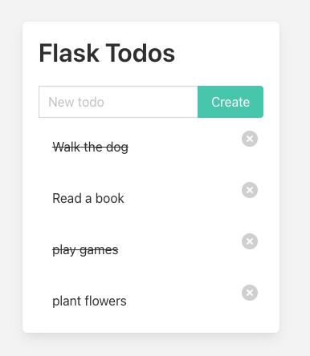

# Explanations
## Bulma

Bulma is purely a CSS framework.

Bulma is a free, open-source, modern CSS framework that does not include any JavaScript

**Bulma has no role in CSRF protection.**

I include bulma css from the cdn as I don’t want to download it, see the cloudflare note in `index.html`

## CSFR

**CSRF** stands for **Cross-Site Request Forgery** — it's a type of web security vulnerability.

### CSFR in templates

`{{ csrf_token() }}` in Templates
This Jinja2 function generates a unique CSRF token for the current session.

It’s tied to the user’s session and signed using the SECRET_KEY.

When included in a form, it gets submitted with the request and validated by Flask-WTF.

### CSRFProtect

`csrf = CSRFProtect(app)`

This line activates CSRF protection across your app.

It:
- Hooks into Flask’s request lifecycle
- Checks for a valid CSRF token on every POST, PUT, PATCH, or DELETE request
- Raises a 400 Bad Request if the token is missing or invalid

### Secret Key

app.config['SECRET_KEY']

This is a cryptographic key used to sign session cookies and CSRF tokens.

It ensures that tokens are tamper-proof — if someone tries to forge one, Flask will detect it.

Without this key, Flask-WTF cannot generate or validate CSRF tokens.

### 🔁 How It All Connects

| Component          | Role                                           |
|--------------------|------------------------------------------------|
| SECRET_KEY         | Signs the CSRF token to prevent tampering      |
| CSRFProtect(app)   | Enables automatic CSRF checking on incoming requests |
| {{ csrf_token() }} | Generates a secure token to include in forms   |
| Hidden input field | Sends the token back to the server for validation |


### 🧠 Summary

When a user loads a form:

- Flask-WTF generates a CSRF token using the SECRET_KEY
- You include it in the form with `{{ csrf_token() }}`
- When the form is submitted, Flask checks the token
- If it’s valid, the request proceeds; if not, it’s blocked


### 🔧 Under the Hood (Simplified)
Flask-WTF might generate a token like:

```
csrf_token = base64(payload + HMAC(payload, SECRET_KEY))
```

payload = user/session info + timestamp

HMAC = cryptographic hash function using SECRET_KEY

The result is a signed token that can’t be forged without knowing the secret

### ✅ What Is HMAC?

HMAC (Hash-based Message Authentication Code) is a cryptographic mechanism used to verify:
- Integrity – the data wasn’t changed
- Authenticity – the data was generated by someone who knows a shared secret

It combines:
- a hash function (like SHA-256)
- a secret key

to generate a signature for data.

A simple view:
hmac = HASH(secret_key + message)


If the message changes → the HMAC won't match.
If someone doesn’t know the secret key → they cannot forge the HMAC.

### Output

